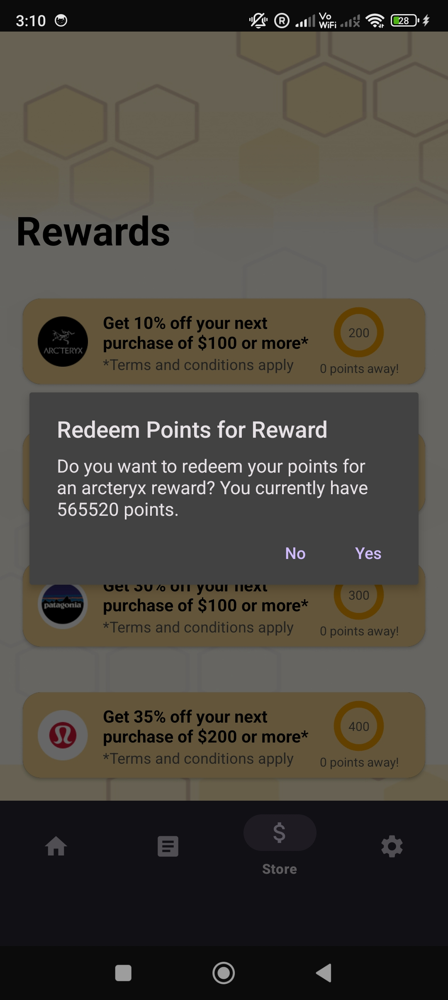

# beeFit
beeFit is a full-stack fitness-tracking plus loyalty program Android app that aims to enhance omnichannel integration and encourage users to stay healthy.

## Table of Contents
* [About](#about)
* [Getting Started](#getting-started)
  * [Backend Setup](#backend-setup)
  * [Frontend Setup](#frontend-setup)
* [Usage](#usage)
  * [Login and Signup](#login-and-signup)
  * [Home](#home)
  * [Chat](#chat)
  * [Store](#store)
  * [Settings](#settings)
* [Acknowledgments](#acknowledgments)
* [License](#license)
* [Contact](#contact)

## About
Users can earn points by achieving their fitness goals and redeem rewards using the earned points to—hypothetically—shop at the retail stores that the app partners with.

Please be advised that the brands and stores used in this app are for demonstration purposes only.

## Getting Started
The following introduces how to set up the backend and frontend to run the app locally. 

### Backend Setup
* Clone [beeFit-backend](https://github.com/eswlo/beeFit-backend).
* Download and install [Node.js](https://nodejs.org/en) if needed.
* Set up [MongoDB](https://www.mongodb.com/) and have the connection string ready.
* Open the cloned folder in your chosen IDE and execute `npm install` in the terminal to install the necessary dependencies:
* Create a `.env file` in the folder, and add the following code into the file after replacing `CS` with your MongoDB connection string:
```
MONGODB_URI="CS"
```
* Execute `npm run dev` in the terminal to connect to MongoDB.

### Frontend Setup
* Clone this repo and open it in Android Studio.
* Obtain the GEMINI API key at https://ai.google.dev/gemini-api/docs/api-key
* Locate `local.properties`, and add the following code into the file after replacing `AK` with your own api key
```
API_KEY=AK
```
* To get a better experience, it is recommended to run the app on your mobile device. To do so:
   * Retrieve the IP address where the backend is running.
   * Locate the `NetworkService` file in the `api` folder, and replace the `IP` seen in the following code with the retrieved one:
```
private const val BASE_URL = "http://IP"
```
   * Locate the `network_security_config.xml` file and replace the `IP` seen in the following code with the retrieved one:
```
<domain includeSubdomains="true">IP</domain>
```   
   * Pair your device in Android Studio and run the app.

## Usage
### Login and Signup
Press buttons to log in or create a new account:
</br>
</br>


### Home
Press the button to start tracking and monitoring workout activities, which allows users to earn points.
</br>
</br>

* The app relies on the accelerometer on the mobile device to determine whether the user is moving/exercising and the duration.

### Chat
Chat with the AI bot to get some exercise ideas:
</br>
</br>


### Store
Points earned through completing exercise activities can be used to redeem rewards in Store:
</br>
</br>



### Settings
Account information can be updated here, and redeemed rewards can be viewed and used as well:
</br>
</br>


## Acknowledgments
This project would not have been possible without helps from local and online communities! Some of them are:
* Members of Bug Slayer (Saharah, Jayden, and Weena) for their fabulous talents and contributions to beeFit's [original iOS frontend design/implementation](https://devpost.com/software/beefit?ref_content=existing_user_added_to_software_team&ref_feature=portfolio&ref_medium=email&utm_campaign=software&utm_content=added_to_software_team&utm_medium=email&utm_source=transactional) during the hackathon youCode 2024, where we were awarded an honorable mention :mechanical_arm:
* [Coding Cleverly](https://www.youtube.com/@CodingCleverly)
* [Android Knowledge](https://www.youtube.com/@android_knowledge)
* [Philipp Lackner](https://www.youtube.com/channel/UCKNTZMRHPLXfqlbdOI7mCkg)
* [freeCodeCamp](https://www.freecodecamp.org/)

## License
Distributed under the MIT License.

## Contact
If you have any suggestions or questions, please get in touch and let me know!

:email: s.lo@columbia.edu


   
